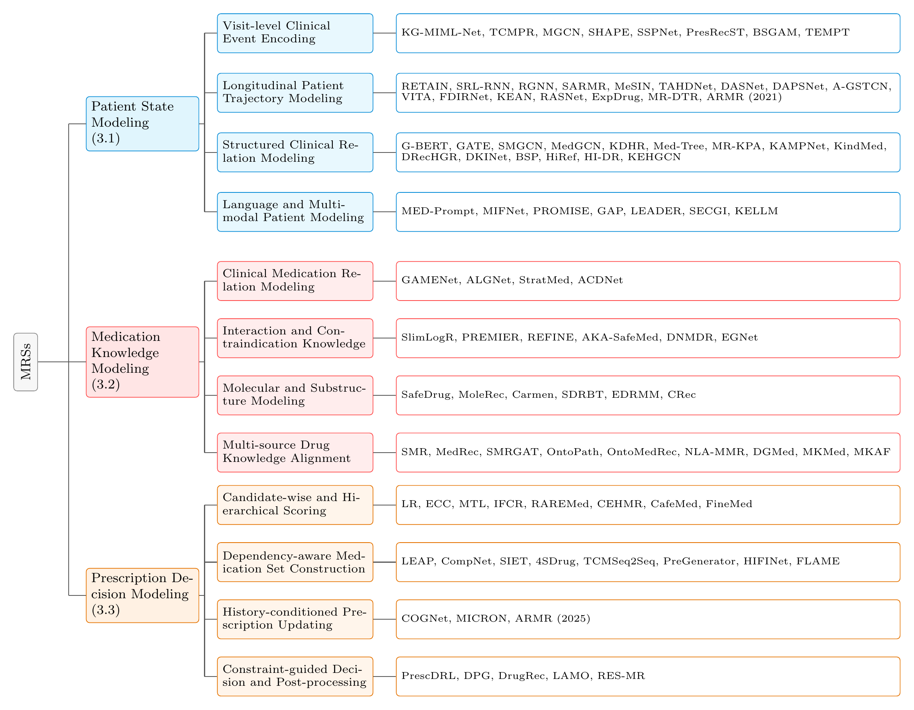

<div align="center">

# EHR-Based Medication Recommendation: A Stage-Oriented Survey and Unified Benchmark


[](#-models)
[](#-datasets)
[](#-installation)
[](#-installation)
[](#-leaderboard)

</div>

## 📰 News

- **[2026-09]** DREAM v1 released with 22 models, 3 datasets (×3 drug-granularity variants each), unified CLI, and multi-GPU batch scheduling.

**DREAM** (**D**rug **R**ecommendation **E**valuation **A**cross **M**ultiple settings) unifies **22 medication recommendation models** under a single training, testing, and comparison framework.

Given a patient's diagnoses, procedures, and historical medication records, each model predicts the drug combination for the current visit — DREAM lets you train, evaluate, and compare them all with one consistent interface.

## 📋 Table of Contents

- [Highlights](#-highlights)
- [Taxonomy](#-taxonomy)
- [Leaderboard](#-leaderboard)
- [Installation](#-installation)
- [Quick Start](#-quick-start)
- [Advanced Usage](#-advanced-usage)
- [Benchmark Protocol](#-benchmark-protocol)
- [Models](#-models)
- [Datasets](#-datasets)
- [Project Structure](#-project-structure)
- [Citation](#-citation)
- [Acknowledgements](#-acknowledgements)

## ✨ Highlights

- **22 models, one interface** — from RETAIN (2016) to MR-DTR (2025), every model shares the same train/test/run commands and config format.
- **3 benchmark datasets** — MIMIC-III, MIMIC-IV, and eICU, each processed at three drug-granularity levels (**all-level / ATC-3 / ATC-4**).
- **Unified CLI** — `train`, `test`, and `run` subcommands work for any model × dataset combination.
- **Multi-GPU batch scheduling** — queue dozens of (model, dataset) jobs; the scheduler dispatches them across GPUs based on live memory/utilization from `nvidia-smi`, with a real-time terminal dashboard.
- **Standardized evaluation** — Jaccard, PRAUC, F1, and DDI-rate metrics, multi-seed runs, and cross-seed summary reports out of the box.
- **Unified benchmark protocol** — identical data processing (DrugBank standardization, DDInter DDI knowledge), patient-level splits, and training/evaluation settings for every model, enabling fair comparison (see [Benchmark Protocol](#-benchmark-protocol)).

## 🗂️ Taxonomy

The survey organizes EHR-based medication recommendation into three functional stages — **patient state modeling**, **medication knowledge modeling**, and **prescription decision modeling** — each further divided into subcategories:

<div align="center">

</div>

## 🏆 Leaderboard

🚧 An interactive leaderboard is under construction and will be published on GitHub Pages: **https://novzyg.github.io/DREAM**

Full benchmark results from the survey: mean ± std over 5 seeds. Best result per column in **bold**. "--" denotes results not reported due to incompatibility between fine-grained text-based outputs and aggregated ATC labels.

### All-level

<details open>
<summary><b>MIMIC-III</b></summary>

| Method | Jaccard ↑ | PRAUC ↑ | F1 ↑ | DDI ↓ |
|:---|---:|---:|---:|---:|
| LR | 26.09±1.47 | 33.52±2.87 | 39.87±2.02 | 7.34±0.23 |
| ECC | 25.64±1.62 | 47.23±0.62 | 39.03±2.42 | 7.28±0.23 |
| RETAIN | 27.97±0.31 | 50.85±0.30 | 42.48±0.41 | 7.35±0.12 |
| LEAP | 23.76±0.33 | 33.09±1.03 | 37.06±0.40 | 7.16±0.50 |
| GAMENet | 21.43±0.46 | 40.59±1.55 | 34.44±0.61 | 7.37±0.37 |
| G-BERT | 23.20±0.43 | 47.36±0.46 | 36.43±0.54 | 7.31±0.20 |
| CompNet | 17.76±1.35 | 43.00±0.33 | 29.34±1.98 | 7.25±1.78 |
| MICRON | 28.89±0.25 | 53.71±0.70 | 43.80±0.29 | 7.19±0.13 |
| SafeDrug | 25.64±0.41 | 49.70±0.43 | 39.81±0.55 | 6.91±0.06 |
| COGNet | 22.86±3.71 | 52.87±0.79 | 35.59±4.92 | 7.34±0.69 |
| PREMIER | 28.36±0.46 | 50.37±0.62 | 43.08±0.57 | 8.29±0.06 |
| 4SDrug | 29.48±0.45 | 49.77±0.79 | 44.56±0.47 | 6.97±0.23 |
| DrugRec | 21.26±0.52 | 35.26±0.84 | 34.41±0.63 | 7.10±0.32 |
| REFINE | 29.68±0.38 | 49.35±0.90 | 44.73±0.43 | 8.26±0.16 |
| MedRec | 25.92±0.72 | 51.78±0.45 | 39.28±0.90 | 6.93±0.27 |
| MoleRec | 28.77±0.25 | 50.19±0.50 | 43.63±0.31 | **6.56±0.15** |
| Carmen | 26.75±0.27 | 50.55±0.83 | 41.28±0.35 | 8.08±0.15 |
| OntoPath | 24.59±0.94 | 46.29±1.41 | 37.77±1.25 | 7.79±0.73 |
| VITA | 26.20±3.87 | 53.08±1.00 | 39.87±2.30 | 7.34±0.95 |
| DRecHGR | 27.94±0.46 | 46.59±0.78 | 43.13±0.55 | 7.78±0.22 |
| RAREMed | 27.69±0.10 | 45.89±0.33 | 41.89±0.10 | 7.22±0.25 |
| MR-DTR | 28.97±0.47 | 50.90±0.85 | 43.43±0.56 | 7.16±0.25 |
| TEMPT | 26.65±0.45 | 45.62±0.76 | 40.98±0.57 | 7.37±0.20 |
| ARMR | 29.69±0.76 | 54.09±0.78 | 44.24±0.97 | 7.26±0.11 |
| SSPNet | 28.43±2.86 | 41.10±2.20 | 42.90±3.35 | 7.25±1.96 |
| LAMO | 31.48±0.62 | 55.20±0.70 | 45.92±0.70 | 7.29±0.11 |
| FLAME | **34.07±0.70** | **58.80±0.82** | **49.34±0.75** | 7.17±0.30 |

</details>

<details>
<summary><b>MIMIC-IV</b></summary>

| Method | Jaccard ↑ | PRAUC ↑ | F1 ↑ | DDI ↓ |
|:---|---:|---:|---:|---:|
| LR | 27.28±0.48 | 43.25±0.62 | 41.50±0.57 | 6.61±0.13 |
| ECC | 25.65±0.49 | 51.31±0.40 | 38.93±0.62 | 6.55±0.13 |
| RETAIN | 29.96±0.29 | 53.17±0.22 | 45.04±0.32 | 6.49±0.28 |
| LEAP | 27.73±0.26 | 35.82±1.16 | 42.31±0.33 | 6.43±0.27 |
| GAMENet | 20.99±0.51 | 46.16±0.50 | 33.91±0.69 | 6.39±0.09 |
| G-BERT | 24.21±0.57 | 51.04±0.38 | 38.11±0.74 | 6.58±0.10 |
| CompNet | 19.95±0.71 | 45.95±0.34 | 32.44±0.95 | 6.52±0.78 |
| MICRON | 29.12±0.25 | 56.59±0.28 | 44.23±0.30 | 6.46±0.04 |
| SafeDrug | 26.16±0.80 | 53.39±0.34 | 40.59±0.99 | 6.12±0.03 |
| COGNet | 26.69±0.86 | 55.76±0.59 | 40.60±1.18 | 6.61±1.50 |
| PREMIER | 29.42±0.78 | 54.00±0.27 | 44.49±0.93 | 6.15±0.08 |
| 4SDrug | 29.62±0.42 | 54.40±0.45 | 44.61±0.45 | 6.49±0.14 |
| DrugRec | 28.40±0.60 | 47.93±0.72 | 42.96±0.67 | 6.43±0.19 |
| REFINE | 29.77±0.43 | 53.07±0.86 | 44.98±0.52 | 6.24±0.12 |
| MedRec | 29.03±0.18 | 55.17±0.30 | 43.49±0.25 | 6.58±0.14 |
| MoleRec | 27.99±0.25 | 53.19±0.84 | 42.89±0.31 | **5.77±0.10** |
| Carmen | 27.68±0.19 | 52.34±0.28 | 42.50±0.22 | 6.35±0.07 |
| OntoPath | 28.54±0.78 | 51.04±0.44 | 42.98±0.97 | 6.40±0.37 |
| VITA | 31.00±2.13 | 56.34±0.11 | 46.10±2.54 | 6.61±0.08 |
| DRecHGR | 31.81±0.38 | 53.31±0.78 | 47.39±0.43 | 6.55±0.10 |
| RAREMed | 30.71±1.12 | 49.19±1.58 | 45.81±1.16 | 6.49±0.22 |
| MR-DTR | 34.99±0.57 | 57.36±0.82 | 50.67±0.64 | 6.43±0.15 |
| TEMPT | 29.60±0.53 | 51.40±0.78 | 44.30±0.61 | 6.37±0.15 |
| ARMR | 33.62±1.00 | 58.09±1.00 | 48.98±1.21 | 6.58±0.29 |
| SSPNet | 26.88±1.91 | 51.11±2.20 | 41.41±2.36 | 6.52±0.60 |
| LAMO | 32.05±0.85 | 58.30±0.76 | 49.22±0.92 | 6.35±0.22 |
| FLAME | **35.15±0.90** | **60.60±0.85** | **51.85±0.95** | 6.60±0.28 |

</details>

<details>
<summary><b>eICU</b></summary>

| Method | Jaccard ↑ | PRAUC ↑ | F1 ↑ | DDI ↓ |
|:---|---:|---:|---:|---:|
| LR | 14.40±0.77 | 32.07±1.12 | 27.56±1.13 | 6.48±0.63 |
| ECC | 11.66±1.09 | 30.26±0.26 | 26.93±1.75 | 6.69±0.63 |
| RETAIN | 18.58±0.39 | 45.49±0.35 | 28.15±0.56 | 6.63±0.75 |
| LEAP | 10.12±0.53 | 27.10±1.88 | 15.62±0.85 | 6.57±1.45 |
| GAMENet | 23.00±0.47 | 42.70±0.95 | 35.03±0.60 | 7.83±0.45 |
| G-BERT | 18.35±0.36 | 43.23±0.48 | 28.05±0.72 | 6.45±0.67 |
| CompNet | 10.52±2.36 | 38.61±0.66 | 16.57±3.89 | 6.66±0.90 |
| MICRON | 23.06±0.36 | 43.30±0.44 | 35.12±0.40 | 6.60±0.26 |
| SafeDrug | 20.93±0.49 | 40.96±0.38 | 32.46±0.61 | 6.20±0.64 |
| COGNet | 17.81±0.94 | 44.21±0.64 | 26.79±1.30 | 6.48±0.49 |
| PREMIER | 24.33±0.23 | 45.36±0.54 | 36.39±0.18 | 7.08±0.22 |
| 4SDrug | 24.06±0.41 | 43.70±0.72 | 36.24±0.42 | 6.63±0.61 |
| DrugRec | 19.43±0.52 | 38.63±0.92 | 28.29±0.59 | 6.57±0.59 |
| REFINE | 24.50±0.44 | 45.09±0.57 | 36.91±0.48 | 6.66±0.66 |
| MedRec | 12.67±0.63 | 42.06±0.50 | 19.38±0.93 | 6.45±0.27 |
| MoleRec | 22.27±0.51 | 42.71±0.52 | 33.93±0.67 | **5.85±0.46** |
| Carmen | 22.16±0.38 | 41.72±0.72 | 33.86±0.44 | 6.60±0.65 |
| OntoPath | 10.76±1.90 | 39.46±0.61 | 16.87±2.97 | 6.54±1.69 |
| VITA | 17.01±2.21 | 44.90±0.37 | 26.26±2.50 | 6.48±1.27 |
| DRecHGR | 20.60±0.58 | 41.28±0.70 | 30.47±0.63 | 6.69±0.30 |
| RAREMed | 14.21±1.07 | 38.30±0.36 | 22.65±1.70 | 6.63±0.80 |
| MR-DTR | 21.41±0.41 | 44.88±0.68 | 28.73±0.57 | 6.57±0.63 |
| TEMPT | 23.85±0.45 | 39.49±0.65 | 37.96±0.54 | 6.51±0.55 |
| ARMR | 17.08±0.86 | 42.33±1.98 | 26.01±1.12 | 6.50±1.13 |
| SSPNet | 22.83±1.84 | 41.50±2.37 | 35.20±2.26 | 6.66±2.00 |
| LAMO | 23.82±0.72 | 46.10±0.88 | 36.85±0.80 | 6.95±0.55 |
| FLAME | **24.80±0.78** | **47.65±0.92** | **38.10±0.88** | 6.45±0.60 |

</details>

### ATC-3

<details>
<summary><b>MIMIC-III</b></summary>

| Method | Jaccard ↑ | PRAUC ↑ | F1 ↑ | DDI ↓ |
|:---|---:|---:|---:|---:|
| LR | 36.61±1.30 | 39.06±3.20 | 51.67±1.55 | 66.81±1.15 |
| ECC | 35.97±1.42 | 55.04±0.69 | 50.58±1.86 | 66.65±1.15 |
| RETAIN | 39.74±0.33 | 65.72±0.36 | 55.63±0.33 | 66.02±1.41 |
| LEAP | 33.93±0.30 | 34.17±1.06 | 49.30±0.30 | 65.75±1.28 |
| GAMENet | 30.06±0.42 | 47.30±0.88 | 44.63±0.45 | 66.89±1.21 |
| G-BERT | 33.39±0.46 | 59.32±0.53 | 48.81±0.45 | 67.15±1.21 |
| CompNet | 30.74±0.89 | 59.49±0.41 | 45.98±1.04 | 73.06±1.15 |
| MICRON | 40.53±0.42 | 62.59±0.88 | 56.76±0.45 | 66.41±1.21 |
| SafeDrug | 34.91±0.49 | 58.01±0.46 | 50.04±0.57 | 65.50±0.05 |
| COGNet | 34.21±0.94 | 66.59±0.67 | 48.68±1.26 | 65.91±2.97 |
| PREMIER | 42.31±0.39 | 66.04±0.61 | 58.11±0.39 | 66.65±0.31 |
| 4SDrug | 41.15±0.31 | 61.04±0.79 | 56.88±0.56 | 66.49±1.27 |
| DrugRec | 37.15±0.40 | 55.39±0.80 | 52.41±0.75 | 66.33±1.33 |
| REFINE | **44.16±0.44** | 67.41±0.78 | **59.96±0.44** | 66.89±1.08 |
| MedRec | 37.51±0.63 | 65.18±0.67 | 52.95±0.72 | 67.32±0.60 |
| MoleRec | 40.80±1.10 | 64.80±1.20 | 56.70±1.30 | **64.50±4.80** |
| Carmen | 42.34±0.40 | 65.92±0.61 | 58.15±0.39 | 66.41±0.52 |
| OntoPath | 34.81±1.05 | 61.18±1.26 | 49.91±1.20 | 66.25±1.54 |
| VITA | 32.86±2.92 | 68.21±0.66 | 48.01±3.38 | 66.58±2.19 |
| DRecHGR | 40.08±0.46 | 60.12±0.86 | 55.89±0.51 | 68.11±0.18 |
| RAREMed | 32.31±0.99 | 59.54±0.42 | 47.71±1.09 | 72.39±4.37 |
| MR-DTR | 40.64±0.41 | 59.32±0.94 | 56.28±0.43 | 66.33±1.21 |
| TEMPT | 39.94±0.49 | 60.36±0.88 | 55.62±0.57 | 66.89±0.20 |
| ARMR | 41.17±0.50 | **68.60±0.50** | 56.79±0.61 | 66.73±1.10 |
| SSPNet | 31.01±2.52 | 43.46±3.36 | 46.14±2.87 | 66.57±5.80 |
| LAMO | -- | -- | -- | -- |
| FLAME | -- | -- | -- | -- |

</details>

<details>
<summary><b>MIMIC-IV</b></summary>

| Method | Jaccard ↑ | PRAUC ↑ | F1 ↑ | DDI ↓ |
|:---|---:|---:|---:|---:|
| LR | 37.43±0.37 | 50.44±0.71 | 52.59±0.41 | 65.85±0.34 |
| ECC | 35.20±0.38 | 59.85±0.46 | 49.33±0.44 | 65.53±0.34 |
| RETAIN | 42.17±0.10 | 69.00±0.30 | 58.25±0.10 | 56.35±0.38 |
| LEAP | 39.12±0.56 | 35.56±0.76 | 55.10±0.57 | 56.19±0.64 |
| GAMENet | 28.80±0.42 | 53.84±0.70 | 42.97±0.45 | 62.02±0.39 |
| G-BERT | 35.02±0.41 | 63.71±0.53 | 50.22±0.41 | 58.92±0.35 |
| CompNet | 33.81±0.41 | 62.64±0.45 | 49.44±0.47 | 60.64±0.68 |
| MICRON | 39.96±0.42 | 66.00±0.70 | 56.05±0.45 | 61.48±0.39 |
| SafeDrug | 35.09±0.45 | 62.21±0.42 | 50.13±0.53 | 55.20±0.05 |
| COGNet | 38.41±0.90 | 70.46±0.63 | 53.33±1.22 | 58.72±2.93 |
| PREMIER | 45.68±0.25 | 69.92±0.20 | 61.62±0.22 | 56.51±0.33 |
| 4SDrug | 43.01±0.47 | 64.79±0.39 | 58.78±0.44 | 56.35±0.49 |
| DrugRec | 46.05±0.64 | 66.50±0.76 | 61.39±0.71 | 56.19±0.47 |
| REFINE | 47.41±0.28 | 71.60±0.22 | 63.24±0.27 | 56.03±0.28 |
| MedRec | 41.43±0.47 | 69.26±0.23 | 57.23±0.48 | 55.94±0.63 |
| MoleRec | 41.20±1.30 | 66.50±1.40 | 57.30±1.40 | **54.20±4.80** |
| Carmen | 45.16±0.21 | 69.54±0.25 | 61.13±0.22 | 56.27±0.42 |
| OntoPath | 39.10±0.48 | 66.23±0.81 | 54.87±0.60 | 55.95±1.58 |
| VITA | 39.10±0.99 | 71.13±0.33 | 55.09±1.04 | 56.59±1.23 |
| DRecHGR | 46.16±0.42 | 67.57±0.82 | 61.83±0.47 | 59.27±0.14 |
| RAREMed | 36.46±2.34 | 63.75±1.42 | 52.15±2.35 | 56.59±2.41 |
| MR-DTR | **48.01±0.44** | 66.90±0.94 | **64.21±0.46** | 60.43±0.39 |
| TEMPT | 45.02±0.45 | 66.29±0.84 | 60.78±0.53 | 55.89±0.16 |
| ARMR | 45.00±0.38 | **72.86±0.68** | 60.88±0.38 | 56.59±0.30 |
| SSPNet | 32.88±2.00 | 47.17±3.69 | 48.19±2.30 | 56.43±4.59 |
| LAMO | -- | -- | -- | -- |
| FLAME | -- | -- | -- | -- |

</details>

<details>
<summary><b>eICU</b></summary>

| Method | Jaccard ↑ | PRAUC ↑ | F1 ↑ | DDI ↓ |
|:---|---:|---:|---:|---:|
| LR | 17.83±1.44 | 36.30±2.24 | 33.66±1.97 | 43.75±1.54 |
| ECC | 14.45±2.03 | 34.25±0.52 | 32.88±3.06 | 43.50±1.54 |
| RETAIN | 26.14±0.75 | 50.74±1.34 | 38.90±1.04 | 52.38±2.42 |
| LEAP | 12.83±0.95 | 34.42±1.36 | 19.65±1.40 | 43.90±2.97 |
| GAMENet | 28.48±0.79 | 48.33±1.36 | 42.78±1.07 | 55.25±1.54 |
| G-BERT | 22.19±0.71 | 50.40±1.34 | 33.34±0.95 | 45.93±2.30 |
| CompNet | 12.04±2.10 | 47.98±0.80 | 18.69±3.40 | 44.14±5.80 |
| MICRON | 28.55±0.79 | 49.01±1.36 | 42.89±1.07 | 51.68±1.54 |
| SafeDrug | 25.94±0.37 | 47.97±0.34 | 38.84±0.73 | 42.75±0.18 |
| COGNet | 21.72±0.38 | 53.63±0.54 | 31.88±0.51 | 54.00±4.05 |
| PREMIER | 29.64±0.58 | 53.69±0.45 | 42.57±0.90 | 56.13±1.17 |
| 4SDrug | 29.76±0.47 | 50.26±1.32 | **43.69±0.48** | 53.24±1.83 |
| DrugRec | 27.27±0.56 | 50.51±0.96 | 37.00±0.63 | 56.93±1.54 |
| REFINE | **29.98±0.42** | 53.50±0.86 | 43.39±0.43 | 55.49±2.13 |
| MedRec | 18.48±0.79 | 50.49±0.76 | 27.32±1.10 | 54.95±0.66 |
| MoleRec | 22.92±1.99 | 49.75±0.59 | 34.65±2.71 | **26.05±4.50** |
| Carmen | 28.63±0.33 | 51.13±1.04 | 41.90±0.34 | 55.30±1.52 |
| OntoPath | 14.14±2.58 | 48.96±1.00 | 21.14±3.65 | 56.32±3.14 |
| VITA | 20.91±2.25 | **54.69±0.41** | 31.21±2.50 | 50.38±1.31 |
| DRecHGR | 24.48±0.34 | 49.74±0.74 | 33.47±0.67 | 59.05±0.34 |
| RAREMed | 18.50±2.20 | 47.85±0.80 | 30.20±2.30 | 42.80±4.30 |
| MR-DTR | 26.52±0.77 | 50.80±1.36 | 35.08±0.99 | 60.73±1.54 |
| TEMPT | 25.89±0.37 | 49.19±0.76 | 40.10±0.62 | 57.61±0.08 |
| ARMR | 20.04±1.00 | 49.62±3.34 | 29.80±1.32 | 51.32±1.83 |
| SSPNet | 27.76±0.45 | 43.10±1.52 | 41.24±0.53 | 54.47±5.42 |
| LAMO | -- | -- | -- | -- |
| FLAME | -- | -- | -- | -- |

</details>

### ATC-4

<details>
<summary><b>MIMIC-III</b></summary>

| Method | Jaccard ↑ | PRAUC ↑ | F1 ↑ | DDI ↓ |
|:---|---:|---:|---:|---:|
| LR | 29.48±1.09 | 36.15±1.87 | 43.98±1.38 | 37.14±0.77 |
| ECC | 28.96±1.20 | 50.93±0.40 | 43.05±1.64 | 37.69±0.77 |
| RETAIN | 32.44±0.23 | 56.56±0.16 | 47.76±0.26 | 42.67±0.83 |
| LEAP | 26.79±0.49 | 34.38±0.51 | 40.97±0.61 | 38.88±0.92 |
| GAMENet | 24.21±0.38 | 43.77±0.49 | 37.99±0.42 | 37.92±0.79 |
| G-BERT | 26.40±0.38 | 51.14±0.24 | 40.76±0.45 | 41.67±0.83 |
| CompNet | 22.83±0.30 | 48.28±0.36 | 36.25±0.41 | 44.06±0.79 |
| MICRON | 32.64±0.38 | 57.92±0.49 | 48.31±0.42 | 38.03±0.79 |
| SafeDrug | 28.32±0.53 | 52.05±0.50 | 42.53±0.61 | 32.52±0.06 |
| COGNet | 26.65±4.91 | 60.03±0.59 | 40.43±2.50 | 39.09±4.77 |
| PREMIER | 34.56±0.44 | 56.78±0.54 | 50.08±0.47 | 34.71±0.29 |
| 4SDrug | 32.79±0.34 | 52.93±0.67 | 47.88±0.34 | 33.93±0.55 |
| DrugRec | 30.14±0.44 | 49.81±0.84 | 44.89±0.51 | 36.08±0.69 |
| REFINE | **36.15±0.23** | 57.98±0.60 | **51.88±0.22** | 34.85±0.54 |
| MedRec | 30.32±0.83 | 56.90±0.47 | 44.71±1.07 | 43.79±0.59 |
| MoleRec | 33.20±0.95 | 56.80±1.10 | 48.90±1.10 | **25.80±2.50** |
| Carmen | 34.30±0.45 | 56.52±0.73 | 49.87±0.50 | 34.49±0.33 |
| OntoPath | 27.28±0.90 | 52.63±1.17 | 40.98±1.09 | 44.55±1.24 |
| VITA | 31.21±0.88 | **60.10±0.49** | 46.10±1.07 | 36.97±1.30 |
| DRecHGR | 32.32±0.50 | 54.18±0.90 | 47.81±0.55 | 40.97±0.22 |
| RAREMed | 27.06±0.97 | 48.53±0.46 | 41.38±1.24 | 42.62±0.70 |
| MR-DTR | 32.72±0.35 | 54.89±0.55 | 47.90±0.38 | 38.81±0.81 |
| TEMPT | 32.47±0.53 | 54.40±0.64 | 47.58±0.61 | 37.66±0.24 |
| ARMR | 33.82±0.55 | 59.76±0.74 | 48.92±0.69 | 37.19±1.05 |
| SSPNet | 29.70±1.65 | 42.20±2.10 | 44.30±1.80 | 34.80±4.20 |
| LAMO | -- | -- | -- | -- |
| FLAME | -- | -- | -- | -- |

</details>

<details>
<summary><b>MIMIC-IV</b></summary>

| Method | Jaccard ↑ | PRAUC ↑ | F1 ↑ | DDI ↓ |
|:---|---:|---:|---:|---:|
| LR | 31.15±0.38 | 46.23±0.54 | 45.97±0.47 | 38.51±0.41 |
| ECC | 29.29±0.38 | 54.85±0.35 | 43.12±0.51 | 38.32±0.41 |
| RETAIN | 34.87±0.09 | 59.99±0.25 | 50.63±0.09 | 37.87±0.43 |
| LEAP | 31.99±0.38 | 36.85±0.56 | 47.30±0.51 | 37.71±0.43 |
| GAMENet | 23.97±0.39 | 49.34±0.54 | 37.56±0.51 | 37.55±0.45 |
| G-BERT | 28.05±0.43 | 55.42±0.55 | 42.45±0.51 | 37.08±0.45 |
| CompNet | 24.96±1.54 | 51.91±0.43 | 39.06±1.94 | 41.68±3.48 |
| MICRON | 33.25±0.39 | 60.49±0.54 | 48.99±0.51 | 37.79±0.45 |
| SafeDrug | 29.28±0.49 | 55.74±0.46 | 43.91±0.57 | 36.89±0.05 |
| COGNet | 30.97±0.94 | 60.96±0.67 | 45.44±1.26 | 37.47±2.97 |
| PREMIER | 37.54±0.25 | 60.95±0.44 | 53.47±0.27 | 38.03±0.39 |
| 4SDrug | 34.67±0.23 | 55.31±0.62 | 50.13±0.56 | 37.87±0.60 |
| DrugRec | 38.07±0.40 | 59.63±0.80 | 53.47±0.75 | 37.71±0.59 |
| REFINE | 38.55±0.11 | 61.46±0.26 | 54.59±0.14 | 37.55±0.38 |
| MedRec | 34.20±0.36 | 61.22±0.25 | 49.44±0.46 | 37.39±0.53 |
| MoleRec | 33.94±0.39 | 57.83±0.54 | 49.77±0.51 | **36.14±0.45** |
| Carmen | 36.76±0.32 | 60.08±0.79 | 52.72±0.37 | 37.79±0.52 |
| OntoPath | 32.22±0.56 | 56.79±1.19 | 47.28±0.62 | 37.63±1.77 |
| VITA | 34.46±2.09 | 64.00±0.53 | 50.13±2.46 | 37.47±1.15 |
| DRecHGR | 38.54±0.46 | 61.33±0.86 | 54.14±0.51 | 38.03±0.18 |
| RAREMed | 32.65±1.43 | 54.38±1.15 | 47.88±1.58 | 37.87±1.46 |
| MR-DTR | **39.95±0.45** | 61.31±0.71 | **56.12±0.53** | 37.71±0.47 |
| TEMPT | 37.70±0.49 | 59.79±0.88 | 53.34±0.57 | 37.55±0.20 |
| ARMR | 37.71±0.48 | **64.87±0.50** | 53.44±0.57 | 37.39±0.39 |
| SSPNet | 30.10±1.70 | 49.20±2.20 | 44.30±1.90 | 37.95±3.00 |
| LAMO | -- | -- | -- | -- |
| FLAME | -- | -- | -- | -- |

</details>

<details>
<summary><b>eICU</b></summary>

| Method | Jaccard ↑ | PRAUC ↑ | F1 ↑ | DDI ↓ |
|:---|---:|---:|---:|---:|
| LR | 15.15±1.39 | 33.06±2.43 | 28.97±1.83 | 23.33±1.21 |
| ECC | 12.27±1.97 | 31.19±0.56 | 28.30±2.84 | 23.33±1.21 |
| RETAIN | 20.05±0.92 | 48.18±0.93 | 30.18±1.24 | 27.29±1.29 |
| LEAP | 11.86±0.66 | 28.49±1.65 | 18.12±0.88 | 23.73±4.18 |
| GAMENet | 24.20±0.78 | 44.02±1.48 | 36.82±0.97 | 31.13±1.21 |
| G-BERT | 18.04±0.74 | 46.00±0.97 | 27.34±1.12 | 23.41±1.13 |
| CompNet | 9.87±0.77 | 41.96±0.70 | 15.29±1.20 | 23.25±3.50 |
| MICRON | 24.26±0.78 | 44.64±1.48 | 36.91±0.97 | 27.56±1.21 |
| SafeDrug | 21.52±0.41 | 44.01±0.38 | 32.65±0.49 | 22.75±0.05 |
| COGNet | 18.84±0.74 | 48.04±0.54 | 28.13±1.15 | 24.61±3.01 |
| PREMIER | 25.35±0.48 | 47.93±0.33 | 37.43±0.65 | 31.65±1.00 |
| 4SDrug | 24.59±0.68 | 45.80±0.81 | 37.20±0.88 | 28.27±1.29 |
| DrugRec | 23.38±0.60 | 45.94±0.72 | 32.31±0.67 | 30.92±1.25 |
| REFINE | **26.05±0.73** | 48.47±0.63 | **38.71±1.03** | 31.39±0.50 |
| MedRec | 13.90±0.71 | 44.74±0.71 | 21.13±1.08 | 28.45±1.84 |
| MoleRec | 21.06±0.46 | 44.97±0.70 | 32.06±0.72 | **14.86±0.98** |
| Carmen | 23.55±0.47 | 45.72±0.58 | 35.45±0.70 | 31.82±1.30 |
| OntoPath | 10.98±1.16 | 42.30±1.03 | 17.12±1.78 | 26.64±5.20 |
| VITA | 17.95±2.01 | **48.91±0.45** | 27.11±2.50 | 25.30±1.35 |
| DRecHGR | 20.83±0.38 | 44.82±0.78 | 28.66±0.43 | 32.17±0.10 |
| RAREMed | 16.20±1.80 | 41.94±0.78 | 26.10±2.00 | 23.89±3.00 |
| MR-DTR | 22.53±0.75 | 46.27±1.47 | 30.19±0.92 | 32.38±1.21 |
| TEMPT | 21.94±0.41 | 44.05±0.80 | 38.60±0.58 | 30.64±0.12 |
| ARMR | 17.05±1.09 | 43.67±1.94 | 25.88±1.70 | 29.44±1.05 |
| SSPNet | 21.06±0.45 | 40.31±1.23 | 33.03±0.62 | 24.12±3.98 |
| LAMO | -- | -- | -- | -- |
| FLAME | -- | -- | -- | -- |

</details>

## 🔧 Installation

```bash
git clone https://github.com/novzyg/DREAM.git
```

Tested environment:

| Dependency | Version |
|:---|:---|
| Python | 3.12 |
| PyTorch | 2.12.0+cu130 |
| dill | 0.4.1 |
| numpy | 2.4.6 |
| pandas | 3.0.3 |
| scikit-learn | 1.9.0 |
| tqdm | 4.68.1 |

> **Package name note:** the code imports itself as the `drugrec_benchmark` package. Make the repo importable under that name, e.g. rename or symlink the clone, and run all commands from the **parent directory**:
>
> ```bash
> ln -s DREAM drugrec_benchmark     # or: mv DREAM drugrec_benchmark
> cd ..                              # parent of drugrec_benchmark/
> ```

Datasets are expected under `drugrec_benchmark/data/<dataset_name>/` (see [Datasets](#-datasets)).

## 🚀 Quick Start

> All commands below run from the parent directory of `drugrec_benchmark/`.

**Train** a model (runs all seeds from its config, default `[1203, 2024, 42, 1234, 5678]`):

```bash
python -m drugrec_benchmark.scripts.train \
  --model safedrug \
  --dataset eicu_atc3 \
  --cuda 0
```

**Test** with automatic checkpoint discovery:

```bash
python -m drugrec_benchmark.scripts.test \
  --model safedrug \
  --dataset eicu_atc3 \
  --cuda 0
```

or point to a specific checkpoint:

```bash
python -m drugrec_benchmark.scripts.test \
  --model safedrug \
  --dataset eicu_atc3 \
  --cuda 0 \
  --checkpoint drugrec_benchmark/results/safedrug/eicu_atc3/seed_1203/run_xxx/models/epoch_xxx_jaccard_xxxx.pth
```

**Train + test + cross-seed summary** in one go:

```bash
python -m drugrec_benchmark.scripts.run \
  --model safedrug \
  --dataset eicu_atc3 \
  --cuda 0
# → drugrec_benchmark/results/safedrug/eicu_atc3/reports/cross_seed_summary_<timestamp>.json
```

Outputs are organized as:

```text
results/<model>/<dataset>/seed_<seed>/run_<time>/     # weights (.pth), logs, per-run report JSON
results/<model>/<dataset>/reports/cross_seed_summary_<timestamp>.json   # mean ± std across seeds
```

## 🛠️ Advanced Usage

The unified entry point `main.py` wraps the scripts above and adds batch execution and GPU-aware scheduling.

<details>
<summary><b>Single task via the unified entry</b></summary>

```bash
python -m drugrec_benchmark.main train --model safedrug --dataset eicu_atc3 --cuda 0
python -m drugrec_benchmark.main test   --model safedrug --dataset eicu_atc3 --cuda 0
python -m drugrec_benchmark.main run    --model safedrug --dataset eicu_atc3 --cuda 0
```
</details>

<details>
<summary><b>Batch: multiple models × datasets across GPUs</b></summary>

```bash
python -m drugrec_benchmark.main run \
  --models safedrug,gamenet,retain \
  --datasets eicu_atc3,mimic-iii_atc3 \
  --cuda-list 0,1 \
  --parallel 2
```

This creates 6 tasks (3 models × 2 datasets) and runs 2 of them concurrently on GPU 0 and GPU 1.
</details>

<details>
<summary><b>GPU-aware scheduling</b></summary>

```bash
python -m drugrec_benchmark.main run \
  --models cognet,molerec \
  --datasets eicu_all,eicu_atc3,eicu_atc4 \
  --cuda-list 0,1,2,3 \
  --parallel 0 \
  --max-procs-per-gpu 3 \
  --worker-threads 1 \
  --gpu-launch-interval 5 \
  --gpu-mem-threshold 0.9 \
  --gpu-util-threshold 100 \
  --poll-interval 5 \
  --no-dashboard
```

Behavior: a new task is launched on a GPU only when its memory usage is below **90%** and utilization below **100%**, with at least **5 s** between consecutive launches on the same GPU; when no GPU qualifies, the scheduler re-checks every **5 s**. Each worker process is limited to **1 thread**, and the live terminal dashboard is disabled.

Key scheduler options (see `python -m drugrec_benchmark.main run --help` for the full list):

| Option | Meaning |
|:---|:---|
| `--parallel N` | Global max concurrent tasks (`0` = auto: `#GPUs × max-procs-per-gpu`) |
| `--max-procs-per-gpu N` | Max concurrent tasks per GPU (`<=0` = no cap) |
| `--gpu-mem-threshold R` | Launch only if GPU memory ratio ≤ R |
| `--gpu-util-threshold U` | Launch only if GPU utilization ≤ U% |
| `--gpu-launch-interval S` | Min seconds between launches on the same GPU |
| `--max-starting-tasks N` | Max tasks in STARTING warmup at once (`<=0` = #GPUs) |
| `--task-warmup-seconds S` | How long a STARTING task counts against the quota above |
| `--worker-threads N` | CPU/BLAS/PyTorch threads per worker (`<=0` = unchanged) |
| `--no-dashboard` | Disable the rich live dashboard (plain heartbeat logs instead) |
| `--scheduler-dir DIR` | Where scheduler state/logs are written |
</details>

<details>
<summary><b>Summarize all experimental results</b></summary>

```bash
python -m drugrec_benchmark.scripts.export_results_summary
```
</details>

Model hyperparameters live in `configs/<model>.yaml` (with `base_config.yaml` as the shared base) — edit these to tune a model.

## ⚖️ Benchmark Protocol

All models in DREAM are evaluated under an identical protocol to ensure fair comparison:

**Data processing**
- Raw drug names are mapped to **DrugBank** identifiers; compound medications are decomposed into single-ingredient drugs when possible.
- DrugBank provides ATC codes and molecular structures; the DDI adjacency matrix is built from **DDInter**.

**Data splits & seeds**
- Patient-level split: **66% / 17% / 17%** (train / validation / test), identical across models.
- All experiments are repeated with **5 random seeds** (default `[1203, 2024, 42, 1234, 5678]`); results are reported as mean ± std.

**Training**
- Adam optimizer, at most **50 epochs**; each sample is the full visit sequence of one patient (single-patient-level batching).
- Hyperparameters selected by grid search on validation Jaccard: learning rate ∈ {1e-4, 5e-4, 1e-3, 5e-3}, weight decay ∈ {0, 1e-5, 1e-4, 1e-3, 1e-2}, gradient clipping ∈ {0.5, 1.0, 2.0, 5.0}.
- Early stopping after 10 consecutive epochs without validation-Jaccard improvement; the best-validation checkpoint is used for testing.

**Metrics**
- Accuracy: **Jaccard, PRAUC, F1** (plus per-example precision/recall).
- Safety: **DDI rate** — the proportion of known drug–drug interaction pairs among all predicted drug pairs (analyzed jointly with accuracy and prescription size).

## 🧠 Models

DREAM integrates **22 models** spanning a decade of medication recommendation research.

| Year | Model | Title | Venue | Paper & Code |
|:----:|:---|:---|:---|:---|
| 2016 | RETAIN | RETAIN: An Interpretable Predictive Model for Healthcare Using Reverse Time Attention Mechanism | NeurIPS | [Paper](https://arxiv.org/abs/1608.05745) · [Code](https://github.com/mp2893/retain) |
| 2017 | Leap | LEAP: Learning to Prescribe Effective and Safe Treatment Combinations for Multimorbidity | KDD | [Paper](https://dl.acm.org/doi/abs/10.1145/3097983.3098109) · [Code](https://github.com/neozhangthe1/AutoPrescribe) |
| 2019 | GAMENet | GAMENet: Graph Augmented Memory Networks for Recommending Medication Combination | AAAI | [Paper](https://ojs.aaai.org/index.php/AAAI/article/view/3905) · [Code](https://github.com/sjy1203/GAMENet) |
| 2019 | CompNet | Order-free Medicine Combination Prediction with Graph Convolutional Reinforcement Learning | CIKM | [Paper](https://dl.acm.org/doi/abs/10.1145/3357384.3357965) · [Code](https://github.com/irlab-sdu/CompNet) |
| 2021 | MICRON | Change Matters: Medication Change Prediction with Recurrent Residual Networks | IJCAI | [Paper](https://arxiv.org/abs/2105.01876) · [Code](https://github.com/ycq091044/MICRON) |
| 2021 | ARMR | Adversarially Regularized Medication Recommendation Model with Multi-hop Memory Network | KAIS | [Paper](https://dl.acm.org/doi/10.1007/s10115-020-01513-9) · [Code](https://github.com/yanda-wang/ARMR) |
| 2021 | SafeDrug | Dual Molecular Graph Encoders for Recommending Effective and Safe Drug Combinations | IJCAI | [Paper](https://arxiv.org/abs/2105.02711) · [Code](https://github.com/ycq091044/SafeDrug) |
| 2021 | PREMIER | Personalizing Medication Recommendation with a Graph-based Approach | ACM TOIS | [Paper](https://dl.acm.org/doi/abs/10.1145/3488668) |
| 2022 | COGNet | COGNet: Conditional Generation Net for Medication Recommendation | TheWebConf | [Paper](https://dl.acm.org/doi/abs/10.1145/3485447.3511936) · [Code](https://github.com/BarryRun/COGNet) |
| 2022 | 4SDrug | 4SDrug: Symptom-based Set-to-set Small and Safe Drug Recommendation | KDD | [Paper](https://dl.acm.org/doi/abs/10.1145/3534678.3539089) · [Code](https://github.com/Melinda315/4SDrug) |
| 2022 | DrugRec | Debiased, Longitudinal and Coordinated Drug Recommendation through Multi-Visit Clinic Records | NeurIPS | [Paper](https://proceedings.neurips.cc/paper_files/paper/2022/hash/b295b3a940706f431076c86b78907757-Abstract-Conference.html) · [Code](https://github.com/ssshddd/DrugRec) |
| 2023 | DRecHGR | Enhancing Drug Recommendations via Heterogeneous Graph Representation Learning in EHR Networks | IEEE TKDE | [Paper](https://ieeexplore.ieee.org/abstract/document/10302298/) · [Code](https://github.com/HjZ1998/DRecHGR-master) |
| 2023 | MoleRec | MoleRec: Combinatorial Drug Recommendation with Substructure-Aware Molecular Representation Learning | TheWebConf | [Paper](https://dl.acm.org/doi/abs/10.1145/3543507.3583872) · [Code](https://github.com/yangnianzu0515/MoleRec) |
| 2023 | MedRec | Knowledge-Enhanced Attributed Multi-Task Learning for Medicine Recommendation | ACM TOIS | [Paper](https://dl.acm.org/doi/abs/10.1145/3527662) |
| 2023 | OntoPath | Ontology-Aware Prescription Recommendation in Treatment Pathways Using Multi-Evidence Healthcare Data | ACM TOIS | [Paper](https://dl.acm.org/doi/abs/10.1145/3579994) · [Code](https://github.com/zyao237/ontopath) |
| 2023 | Carmen | Context-Aware Safe Medication Recommendations with Molecular Graph and DDI Graph Embedding | AAAI | [Paper](https://ojs.aaai.org/index.php/AAAI/article/view/25861) · [Code](https://github.com/bit1029public/Carmen) |
| 2023 | REFINE | REFINE: A Fine-Grained Medication Recommendation System Using Deep Learning and Personalized Drug Interaction Modeling | NeurIPS | [Paper](https://proceedings.neurips.cc/paper_files/paper/2023/hash/4b7439a4ab0b8e4bcb4e2412c6a10a58-Abstract-Conference.html) |
| 2024 | VITA | VITA: 'Carefully Chosen and Weighted Less' Is Better in Medication Recommendation | AAAI | [Paper](https://ojs.aaai.org/index.php/AAAI/article/view/28704) · [Code](https://github.com/jhheo0123/VITA) |
| 2024 | RAREMed | Leave No Patient Behind: Enhancing Medication Recommendation for Rare Disease Patients | SIGIR | [Paper](https://dl.acm.org/doi/abs/10.1145/3626772.3657785) · [Code](https://github.com/zzhUSTC2016/RAREMed) |
| 2025 | SSPNet | SSPNet: Leveraging Robust Medication Recommendation with History and Knowledge | IJCAI | [Paper](https://www.ijcai.org/proceedings/2025/1052) · [Code](https://github.com/ResearchGroupHdZhang/SSPNet) |
| 2025 | TEMPT | A Contrastive Pretrain Model with Prompt Tuning for Multi-center Medication Recommendation | ACM TOIS | [Paper](https://dl.acm.org/doi/abs/10.1145/3706631) · [Code](https://github.com/liuqidong07/TEMPT) |
| 2025 | MR-DTR | Time-aware Medication Recommendation via Intervention of Dynamic Treatment Regimes | TheWebConf | [Paper](https://dl.acm.org/doi/abs/10.1145/3696410.3714533) · [Code](https://github.com/liyifo/MR-DTR) |

## 📊 Datasets

Three public EHR datasets are used, each processed into patient-level longitudinal sequences (diagnoses, procedures, medications) at three drug-granularity levels:

| Dataset | Variants | Description |
|:---|:---|:---|
| [MIMIC-III](https://mimic.mit.edu/docs/iii/) | `mimic-iii_all` / `mimic-iii_atc3` / `mimic-iii_atc4` | Critical care EHR, 2001–2012 |
| [MIMIC-IV](https://mimic.mit.edu/docs/iv/) | `mimic-iv_all` / `mimic-iv_atc3` / `mimic-iv_atc4` | Updated MIMIC, 2008–2019 |
| [eICU](https://eicu.mit.edu/) | `eicu_all` / `eicu_atc3` / `eicu_atc4` | Multi-center ICU EHR |

Granularity levels:

- **all-level** — exact standardized drug codes (finest)
- **ATC-4** — intermediate drug categories
- **ATC-3** — broader therapeutic categories (coarsest)

Statistics of the processed datasets:

| Dataset | Level | #Patients | #Visits | #Diagnoses | #Medications | #Procedures | DDI Rate |
|:---|:---|---:|---:|---:|---:|---:|---:|
| eICU | all-level | 10,568 | 23,080 | 2,575 | 155 | 2,054 | 0.0781 |
| eICU | ATC-3 | 10,526 | 22,988 | 2,572 | 75 | 2,052 | 0.5137 |
| eICU | ATC-4 | 10,526 | 22,988 | 2,572 | 107 | 2,052 | 0.3071 |
| MIMIC-III | all-level | 6,360 | 16,976 | 4,672 | 718 | 1,420 | 0.0819 |
| MIMIC-III | ATC-3 | 6,359 | 16,974 | 4,672 | 148 | 1,420 | 0.5465 |
| MIMIC-III | ATC-4 | 6,359 | 16,974 | 4,672 | 317 | 1,420 | 0.3279 |
| MIMIC-IV | all-level | 8,949 | 24,106 | 11,030 | 877 | 4,810 | 0.0589 |
| MIMIC-IV | ATC-3 | 8,946 | 24,100 | 11,029 | 158 | 4,810 | 0.4872 |
| MIMIC-IV | ATC-4 | 8,946 | 24,100 | 11,029 | 348 | 4,810 | 0.2836 |

Each dataset directory under `data/` contains shared files — `records_final.pkl` (patient sequences), `voc_final.pkl` (vocabularies), `ddi_A_final.pkl` (DDI adjacency), `ehr_adj_final.pkl` (EHR co-occurrence) — plus model-specific extras such as `ddi_mask_H.pkl` (DDI mask) and `SMILES.pkl` (molecular structures).

## 🏗️ Project Structure

```text
DREAM/
├── main.py                # Unified CLI entry: batch execution + GPU-aware scheduler
├── configs/               # Per-model YAML configs (+ shared base_config.yaml)
├── core/                  # Training loop, evaluation, metrics, I/O
├── models/                # Model implementations + registry (@register_model)
│   └── base_model.py      #   shared model interface (forward + compute_loss)
├── scripts/               # train.py / test.py / run.py / train_mrdtr.py
│                          # + export_results_summary.py
├── utils/                 # Config loading, data processing, logging, metrics
│   └── modules/           #   reusable modules (e.g., graph neural networks)
├── data/                  # Processed datasets: data/<dataset_name>/*.pkl
└── results/               # Checkpoints, logs, and report JSONs per run
```

Execution flow:

```text
parse CLI args → load YAML config → load dataset → build model (registry)
→ train / evaluate / test → compute metrics → save logs, weights, reports
```

<div align="center">

</div>

## 📖 Citation

If you use DREAM in your research, please cite:

```bibtex
@misc{zhen2026dream,
  title  = {EHR-Based Medication Recommendation: A Stage-Oriented Survey and Unified Benchmark},
  author = {Zhen, Yeguang and Wang, Shoujin and Li, Yishuo and Hu, Liang and Lian, Defu and Wang, Cong and Lu, Wenpeng},
  year   = {2026},
  url    = {https://github.com/novzyg/DREAM}
}
```

## 🙏 Acknowledgements

DREAM builds on the excellent work of the medication recommendation community — we thank the authors of all [integrated models](#-models) for open-sourcing their code, and the [MIT-LCP](https://mimic.mit.edu/) team for maintaining the MIMIC/eICU datasets.
