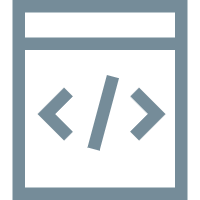

# <div align="center">DREAM: Training and Comparison of Multiple Drug Recommendation Models</div>

**DREAM** is a deep learning project for the drug recommendation task, which integrates multiple models. The models will predict the drug combinations that might be used in the current visit based on the patient's diagnostic information, surgical information, and historical medication records, etc.
<div align="center"></div>

##  Table of Contents </img>
- [Features](#features)
- [Use DREAM](#use-dream)
  - [Environment Reference](#environment-reference)
  - [Train and Test](#train-and-test)
  - [Example](#example)
- [Project Structure](#project-structure)
  - [Overall Framework](#overall-framework)
  - [Directory Structure](#directory-structure)
- [Contents of DREAM](#contents-of-dream)
  - [The Function of Projects](#the-function-of-projects)
  - [The models being used](#the-models-being-used)
  - [Datasets](#datasets)
- [Summary](#summary)

## <div id=features>Features</div>
- **Multiple Models:** We have subsequently integrated over 20 drug recommendation models, such as MR-DTR and TEMPT, etc.
- **Popular Public Datasets**: We utilized three datasets, namely MIMIC-iii, MIMIC-IV and eICU, which are the most commonly used in the drug recommendation model.
- **Unified Training and Testing Entry Point:** For any model in the project, we have designed a unified training and testing script. This means that you can use the uniformly formatted commands to run any of them.

## <div id=use-dream>Use DREAM</div>

### <div id=environment-reference>Environment Reference</div>

- **python**==3.12
- **pytorch**==2.12.0+cu130
- **dill**==0.4.1
- **numpy**==2.4.6
- **pandas**==3.0.3
- **scikit-learn**==1.9.0
- **tqdm**==4.68.1

### <div id=train-and-test>Train and Test</div>
We can use the following commands to train and test the model. 

**Here is the argument**:

```text
usage:python train.py [--model model_name] [--dataset dataset_name] [--cuda gpu_id] 
                      [--batch-size batch_size] [--seed seed]

usage:python run.py [--model model_name] [--dataset dataset_name] [--cuda gpu_id] 
                    [--batch-size batch_size] [--seed seed]

optional arguments:

  --model model_name                     Model Name
  --dataset dataset_name                 Dataset name
  --cuda gpu_id                          The ID of the used GPU
  --batch-size batch_size                The amount of data processed each time
  --seed seed                            Random seed

usage:python test.py [--model model_name] [--dataset dataset_name] [--cuda gpu_id] [--checkpoint checkpoint_path] 
                     [--batch-size batch_size] [--seed seed]

optional arguments:

  --model model_name                     Model Name
  --dataset dataset_name                 Dataset name
  --cuda gpu_id                          The ID of the used GPU
  --checkpoint                           The path of the pth file, if not specified, all checkpoints will be automatically searched
  --batch-size batch_size                The amount of data processed each time
  --seed seed                            Random seed

usage:python main.py [mode] [--model model_name] [--dataset dataset_name] [--models model1,model2,...] [-datasets dataset1,dataset2,...] 
                     [--cuda gpu_id] [--seed seed] [--cuda-list cuda1,cuda2,...] [--parallel num_gpus]
                     [--gpu-mem-threshold mem_threshold] [--gpu-util-threshold util_threshold] [--max-procs-per-gpu num_procs]
                     [--gpu-launch-interval launch_interval] [--poll-interval poll_interval] [--batch-size batch_size]
                     [--max-starting-task] [--task-warmup-seconds] [--worker-threads]
                     [--no-dashboard] [--scheduler-dir scheduler_dir] [--checkpoint checkpoint_path]
                     
optional arguments:
  mode                                   The operation mode is divided into train, test and run.
  --model model_name                     Model Name
  --dataset dataset_name                 Dataset name
  --models model1,model2,...             Train multiple models in sequence
  --datasets dataset1,dataset2,...       Train using multiple datasets in sequence
  --seed seed                            Random seed
  --cuda gpu_id                          The ID of the used GPU
  --cuda-list cuda1,cuda2,...            Used for dynamic scheduling of multiple cards.
  --gpu-mem-threshold mem_threshold      The threshold for GPU memory usage rate
  --gpu-util-threshold util_threshold    GPU usage threshold
  --max-procs-per-gpu num_procs          The maximum number of concurrent tasks on each GPU
  --gpu-launch-interval launch_interval  The minimum interval in seconds for consecutive task startup on the same GPU
  --parallel num_gpus                    The global maximum number of concurrent tasks
  --poll-interval poll_interval          Polling interval in seconds when no GPU is available
  --batch-size batch_size                The amount of data processed each time
  --max-starting-task                    The maximum number of tasks that are currently in the STARTING (preheating) state. When it is less than or equal to 0, it is defaulted to be equal to the number of GPUs
  --task-warmup-seconds                  The duration (in seconds) during which a STARTING task occupies the max-starting-tasks quota
  --worker-threads                       The number of CPU/BLAS/PyTorch threads per worker process (≤ 0 indicates no modification)
  --no-dashboard                         Disable dashboard
  --scheduler-dir scheduler_dir          Scheduler log/status storage path
  --checkpoint checkpoint_path           The path of the pth file
                 
```

**Notes for Attention:** The `--config` parameter is declared in `scripts/train.py` and `scripts/test.py`, but the current code does not actually pass it to `load_config`. Therefore, the custom config will not take effect as a replacement for the current one. The model hyperparameters mainly come from `drugrec_benchmark/configs/*.yaml` and `base_config.yaml`.

### <div id=example>Example</div>

First of all, please clone it from Github:
```bash
git clone https://github.com/novzyg/DREAM.git
```
and then, make sure that you are in the DREAM directory and the datasets are in the `DREAM/data` directory.

#### Single Model Training:

```bash
python -m scripts.train \
  --model safedrug \
  --dataset eicu_atc3 \
  --cuda 0
```
The result list is roughly as follows:
```Text
DREAM/results/<model>/<dataset>/seed_<seed>/run_<time>/epoch_xxx_jaccard_xxxx.pth 
```

#### Single Model Testing and Automatically Finding Checkpoint:

```bash
python -m scripts.test \
  --model safedrug \
  --dataset eicu_atc3 \
  --cuda 0
```
Of cources, we can also specify the checkpoint via `--checkpoint`:

```bash
python -m scripts.test \
  --model safedrug \
  --dataset eicu_atc3 \
  --cuda 0 \
  --checkpoint DREAM/results/safedrug/eicu_atc3/seed_1203/run_xxx/models/epoch_xxx_jaccard_xxxx.pth 
```
After that, you can find the test results in `DREAM/results/safedrug/eicu_atc3/seed_1203/run_xxx/report/`. It is a JSON file.

#### Test immediately after training and generate a cross-seed summary:

```bash
python -m scripts.run \
  --model safedrug \
  --dataset eicu_atc3 \
  --cuda 0
```
and then we will obtain the file named:
`DREAM/results/safedrug/eicu_atc3/reports/cross_seed_summary.json`

#### Use the unified entry for operation:

We can use the unified entry point `main.py` to run single tasks, multiple tasks, and to schedule the GPU.

- **Single Model Training:**

```bash
python -m main train \
  --model safedrug \
  --dataset eicu_atc3 \
  --cuda 0
```

- **Single Model Testing and Automatically Finding Checkpoint:**

```bash
python -m main test \
  --model safedrug \
  --dataset eicu_atc3 \
  --cuda 0
```

- **Run multiple models and datasets in batches:**

```bash
python -m main run \
  --models safedrug,gamenet,retain \
  --datasets eicu_atc3,mimic-iii_atc3 \
  --cuda-list 0,1 \
  --parallel 2
```
The program will respectively use eicu_atc3 and mimic-iii_atc3 and sequentially run the models SafeDrug, GAMENet, and Retain, and They will run in parallel on two GPUs.

- **GPU Scheduling:**
```bash
python -m main run \
  --models cognet,molerec \
  --datasets eicu_all,eicu_atc3,eicu_atc4 \
  --cuda-list 0,1,2,3 \
  --parallel 0 \
  --max-procs-per-gpu 3 \
  --worker-threads 1 \
  --gpu-launch-interval 5 \
  --gpu-mem-threshold 0.9 \
  --gpu-util-threshold 100 \
  --poll-interval 5 \
  --no-dashboard
```
This indicates that new tasks can only be initiated on this new GPU when the VRAM usage is less than 90% and the GPU utilization is less than 100%. Moreover, there must be an interval of at least 5 seconds between two consecutive task initiations on the same GPU. When none of the GPUs meet the scheduling criteria, recheck every 5 seconds. Each worker process will only use 1 thread and the real-time terminal dashboard will be disabled.

#### Summarize the experimental results:

```bash
python scripts/export_results_summary.py
```

Additionally, you can modify the YAML file under `DREAM/configs/` to adjust the parameters of the corresponding model.

## <div id=project-structure>Project Structure</div>
### <div id=overall-framework>Overall Framework</div>
The overall framework of DREAM can be divided into five parts: data, configuration, model, training and testing, and tools.

When the program is running, it generally executes in the following order:

```text
Read command parameters
↓
Read the configuration file
↓
Read the dataset
↓
Load the specified model
↓
Train, evaluate and test the model
↓
Calculate metrics
↓
Save the logs, model weights and test results
```

The operation process is roughly as follows:

<div align="center"></div>

### <div id=directory-structure>Directory Structure</div>
The directory structure of DREAM is as follows:

```Text
DREAM
|
|---configs:                           The project has a unified entry point that receives command parameters and initiates the training, testing or complete experimental process based on the parameters.
|    
|---core:                              The core process involves the implementation of data reading, model training, model testing, and evaluation procedures.
|    
|---data:                              Store the data, including the processed dataset files.
|    
|---models:                            Model implementation, storing the specific codes of different drug recommendation models.
|
|---results:                           Store the results of training and testing, including the model weights, logs, and test results.
|    
|---scripts:                           Provide training, testing, complete operation and result summary scripts.
    |    
    |---run.py:                        Test immediately after training and generate a cross-seed summary.
    |    
    |---train.py:                      Single model training.
    |    
    |---test.py:                       Single-model testing.
    |    
    |---train_mrdtr.py:                MR-DTR conducts training in stages.
    |
    |--export_results_summary.py:      Summarize the experimental results
|
|---utils:                             Utility functions provide auxiliary functions such as data processing, configuration reading, log recording, and metric calculation.
    |
    |---modules:                       Store reusable modules such as graph neural networks.
|
|---main.py:                           The unified entry point of the project receives command parameters and, based on these parameters, initiates the training, testing or complete experimental process. It supports both batch training and distributed training.

```

## <div id=contents-of-dream>Contents of DREAM</div>
### <div id=the-function-of-projects>The Function of Projects</div>
This project mainly fulfills the following functions:
1. Train and test the model for drug recommendation.
2. The experimental results of different models were compared based on evaluation indicators such as Jaccard, F1, PRAUC, and DDI Rate.
3. Save the training logs, test results and model parameter files.
### <div id=the-models-being-used>The Models Being Used</div>
DREAM has currently integrated 22 models:

| Date |                                              Model                                               | Title                                                                                                                          | Source                                                     |                                                                            Paper                                                                             |
|:----:|:------------------------------------------------------------------------------------------------:|--------------------------------------------------------------------------------------------------------------------------------|------------------------------------------------------------|:------------------------------------------------------------------------------------------------------------------------------------------------------------:|
| 2016 |                            [Retain](https://github.com/mp2893/retain)                            | Retain: An Interpretable Predictive Model for Healthcare Using Reverse Time Attention Mechanism                                | Proceedings of the 29th NeurlPS                            |                                           [](https://arxiv.org/abs/1608.05745)                                           |
| 2017 |                      [Leap](https://github.com/neozhangthe1/AutoPrescribe)                       | Leap: Learning to Prescribe Effective and Safe Treatment Combinations for Multimorbidity                                       | Proceedings of the 23rd ACM SIGKDD Conference              |                                  [](https://dl.acm.org/doi/abs/10.1145/3097983.3098109)                                  |
| 2019 |                          [GAMENet](https://github.com/sjy1203/GAMENet)                           | GAMENet: Graph Augmented Memory Networks for Recommending Medication Combination                                               | Proceedings of the 40th AAAI Conference                    |                                [](https://ojs.aaai.org/index.php/AAAI/article/view/3905)                                 |
| 2019 |                         [CompNet](https://github.com/irlab-sdu/CompNet)                          | Order-free Medicine Combination Prediction with Graph Convolutional Reinforcement Learning                                     | Proceedings of the 28th ACM International Conference       |                                  [](https://dl.acm.org/doi/abs/10.1145/3357384.3357965)                                  |
| 2021 |                          [MICRON](https://github.com/ycq091044/MICRON)                           | Change matters: Medication Change Prediction with Recurrent Residual Networks                                                  | Proceedings of the 9th IJCAI                               |                                           [](https://arxiv.org/abs/2105.01876)                                           |
| 2021 |                            [ARMR](https://github.com/yanda-wang/ARMR)                            | Adversarially Regularized Medication Recommendation Model with Multi-hop Memory Network                                        | Knowledge and Information Systems                          |                                  [](https://dl.acm.org/doi/10.1007/s10115-020-01513-9)                                   |
| 2021 |                        [SafeDrug](https://github.com/ycq091044/SafeDrug)                         | Dual Molecular Graph Encoders for Recommending Effective and Safe Drug Combinations                                            | Proceeddings of the 9th IJCAI                              |                                           [](https://arxiv.org/abs/2105.02711)                                           |
| 2021 |                                             PREMIER                                              | Personalizing Medication Recommendation with a Graph-based Approach                                                            | ACM Transactions on Information Systems                    |                                      [](https://dl.acm.org/doi/abs/10.1145/3488668)                                      |
| 2022 |                           [COGNet](https://github.com/BarryRun/COGNet)                           | Conditional Generation Net for Medication Recommendation                                                                       | Proceedings of the 29th ACM Web Conference                 |                                  [](https://dl.acm.org/doi/abs/10.1145/3485447.3511936)                                  |
| 2022 |                          [4SDrug](https://github.com/Melinda315/4SDrug)                          | 4sdrug: Symptom-based Set-to-set Small and Safe Drug Recommendation                                                            | Proceedings of the 28th ACM SIGKDD Conference              |                                  [](https://dl.acm.org/doi/abs/10.1145/3534678.3539089)                                  |
| 2022 |                          [DrugRec](https://github.com/ssshddd/DrugRec)                           | Debiased, Longitudinal and Coordinated Drug Recommendation through Multi-Visit Clinic Records                                  | Proceedings of the 35th NeurlPS                            | [](https://proceedings.neurips.cc/paper_files/paper/2022/hash/b295b3a940706f431076c86b78907757-Abstract-Conference.html) |
| 2023 |                       [DRecHGR](https://github.com/HjZ1998/DRecHGR-master)                       | Enhancing Drug Recommendations via Heterogeneous Graph Representation Learning in EHR Networks                                 | IEEE Transactions on Knowledge and Data Engineering        |                               [](https://ieeexplore.ieee.org/abstract/document/10302298/)                                |
| 2023 |                       [MoleRec](https://github.com/yangnianzu0515/MoleRec)                       | MoleRec: Combinatorial Drug Recommendation with Substructure-Aware Molecular Representation Learning                           | Proceedings of the 30th ACM Web Conference                 |                                  [](https://dl.acm.org/doi/abs/10.1145/3543507.3583872)                                  |
| 2023 |                                              MedRec                                              | Knowledge-Enhanced Attributed Multi-Task Learning for Medicine Recommendation                                                  | ACM Transactions on Information Systems                    |                                      [](https://dl.acm.org/doi/abs/10.1145/3527662)                                      |
| 2023 |                         [OntoPath](https://github.com/zyao237/ontopath)                          | Ontology-Aware Prescription Recommendation in Treatment Pathways Using Multi-Evidence Healthcare Data                          | ACM Transactions on Information Systems                    |                                      [](https://dl.acm.org/doi/abs/10.1145/3579994)                                      |
| 2023 |                        [Carmen](https://github.com/bit1029public/Carmen.)                        | Context-Aware Safe Medication Recommendations with Molecular Graph and DDI Graph Embedding                                     | Proceedings of the 44th AAAI Conference                    |                                [](https://ojs.aaai.org/index.php/AAAI/article/view/25861)                                |
| 2023 |                        [REFINE](https://github.com/bit1029public/Carmen.)                        | REFINE: A Fine-Grained Medication Recommendation System Using Deep Learning and Personalized Drug Interaction Modeling         | Proceedings of the 36th NeurlPS                            | [](https://proceedings.neurips.cc/paper_files/paper/2023/hash/4b7439a4ab0b8e4bcb4e2412c6a10a58-Abstract-Conference.html) |
| 2024 |                            [VITA](https://github.com/jhheo0123/VITA)                             | VITA: 'Carefully Chosen and Weighted Less' Is Better in Medication Recommendation                                              | Proceedings of the 45th AAAI conference                    |                                [](https://ojs.aaai.org/index.php/AAAI/article/view/28704)                                |
| 2024 |                        [RAREMed](https://github.com/zzhUSTC2016/RAREMed)                         | Leave No Patient Behind: Enhancing Medication Recommendation for Rare Disease Patients                                         | Proceedings of the 47th international ACM SIGIR conference |                                  [](https://dl.acm.org/doi/abs/10.1145/3626772.3657785)                                  |
| 2025 |                     [SSPNet](https://github.com/ResearchGroupHdZhang/SSPNet)                     | SSPNet: Leveraging Robust Medication Recommendation with History and Knowledge                                                 | Proceedings of the 34th IJCAI                              |                                     [](https://www.ijcai.org/proceedings/2025/1052)                                      |
| 2025 |                          [TEMPT](https://github.com/liuqidong07/TEMPT)                           | A Contrastive Pretrain Model with Prompt Tuning for Multi-center Medication Recommendation                                     | ACM Transactions on Information Systems                    |                                      [](https://dl.acm.org/doi/abs/10.1145/3706631)                                      |
| 2025 |                            [MR-DTR](https://github.com/liyifo/MR-DTR)                            | Time-aware Medication Recommendation via Intervention of Dynamic Treatment Regimes                                             | Proceedings of the 32nd ACM Web Conference                 |                                  [](https://dl.acm.org/doi/abs/10.1145/3696410.3714533)                                  |


### <div id=datasets>Datasets</div>
We used three datasets, [MIMIC-III](https://mimic.mit.edu/docs/iii/), [MIMIC-IV](https://mimic.mit.edu/docs/iv/) and [eICU](https://eicu.mit.edu/) for our experiments. And these datasets will be processed into a unified format. Diagnosis, procedure, and medication records will be organized into patient-level longitudinal sequences. For each dataset, we process it into three types: **all-level, ATC-3, and ATC-4.** 
- The all-level maintain the precise standardized drugs
- The drugs in ATC3 have a wider range of treatment categories
- ATC-4 falls in the middle range of the two

## <div id=summary>Summary</div>
The core concept of the DREAM project is to manage multiple drug recommendation models using a unified experimental framework. `configs` are responsible for configuration, `data` for data, `models` for model implementation, `core` for training and testing processes, `utils` for auxiliary functions, and `scripts` for script-based execution. With this structure, it is possible to quickly switch between models and datasets within the same framework, completing training, testing and result comparison.
