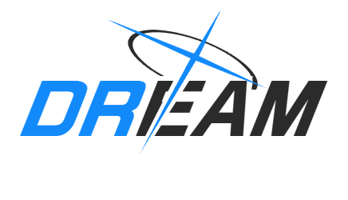
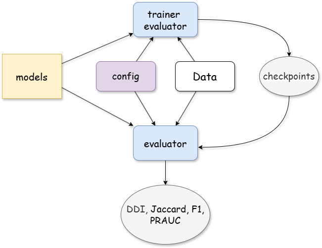

<div align="center">


# DREAM: A Unified Benchmark for Drug Recommendation

**DREAM** (**D**rug **R**ecommendation **E**valuation **A**cross **M**ultiple settings) unifies **22 medication recommendation models** under a single training, testing, and comparison framework.

Given a patient's diagnoses, procedures, and historical medication records, each model predicts the drug combination for the current visit — DREAM lets you train, evaluate, and compare them all with one consistent interface.

DREAM is the unified benchmark introduced in our survey *EHR-Based Medication Recommendation: A Stage-Oriented Survey and Unified Benchmark* (see [Citation](#-citation)), which additionally evaluates five baselines beyond the models integrated here — 27 methods in total.



[](#-models)
[](#-datasets)
[](#-installation)
[](#-installation)
[](#-leaderboard)

</div>

## 📰 News

- **[2026-09]** DREAM v1 released with 22 models, 3 datasets (×3 drug-granularity variants each), unified CLI, and multi-GPU batch scheduling.

## ✨ Highlights

- **22 models, one interface** — from RETAIN (2016) to MR-DTR (2025), every model shares the same train/test/run commands and config format.
- **3 benchmark datasets** — MIMIC-III, MIMIC-IV, and eICU, each processed at three drug-granularity levels (**all-level / ATC-3 / ATC-4**).
- **Unified CLI** — `train`, `test`, and `run` subcommands work for any model × dataset combination.
- **Multi-GPU batch scheduling** — queue dozens of (model, dataset) jobs; the scheduler dispatches them across GPUs based on live memory/utilization from `nvidia-smi`, with a real-time terminal dashboard.
- **Standardized evaluation** — Jaccard, PRAUC, F1, and DDI-rate metrics, multi-seed runs, and cross-seed summary reports out of the box.
- **Unified benchmark protocol** — identical data processing (DrugBank standardization, DDInter DDI knowledge), patient-level splits, and training/evaluation settings for every model, enabling fair comparison (see [Benchmark Protocol](#-benchmark-protocol)).

## 🏆 Leaderboard

🚧 The interactive leaderboard (all methods × all datasets × all metrics) is under construction and will be published on GitHub Pages: **https://novzyg.github.io/DREAM**

The full benchmark results (27 methods × 3 datasets × 3 medication-granularity levels) are reported in our survey paper.

## 📋 Table of Contents

- [Highlights](#-highlights)
- [Leaderboard](#-leaderboard)
- [Installation](#-installation)
- [Quick Start](#-quick-start)
- [Advanced Usage](#-advanced-usage)
- [Benchmark Protocol](#-benchmark-protocol)
- [Models](#-models)
- [Datasets](#-datasets)
- [Project Structure](#-project-structure)
- [Citation](#-citation)
- [Acknowledgements](#-acknowledgements)

## 🔧 Installation

```bash
git clone https://github.com/novzyg/DREAM.git
```

Tested environment:

| Dependency | Version |
|:---|:---|
| Python | 3.12 |
| PyTorch | 2.12.0+cu130 |
| dill | 0.4.1 |
| numpy | 2.4.6 |
| pandas | 3.0.3 |
| scikit-learn | 1.9.0 |
| tqdm | 4.68.1 |

> **Package name note:** the code imports itself as the `drugrec_benchmark` package. Make the repo importable under that name, e.g. rename or symlink the clone, and run all commands from the **parent directory**:
>
> ```bash
> ln -s DREAM drugrec_benchmark     # or: mv DREAM drugrec_benchmark
> cd ..                              # parent of drugrec_benchmark/
> ```

Datasets are expected under `drugrec_benchmark/data/<dataset_name>/` (see [Datasets](#-datasets)).

## 🚀 Quick Start

> All commands below run from the parent directory of `drugrec_benchmark/`.

**Train** a model (runs all seeds from its config, default `[1203, 2024, 42, 1234, 5678]`):

```bash
python -m drugrec_benchmark.scripts.train \
  --model safedrug \
  --dataset eicu_atc3 \
  --cuda 0
```

**Test** with automatic checkpoint discovery:

```bash
python -m drugrec_benchmark.scripts.test \
  --model safedrug \
  --dataset eicu_atc3 \
  --cuda 0
```

or point to a specific checkpoint:

```bash
python -m drugrec_benchmark.scripts.test \
  --model safedrug \
  --dataset eicu_atc3 \
  --cuda 0 \
  --checkpoint drugrec_benchmark/results/safedrug/eicu_atc3/seed_1203/run_xxx/models/epoch_xxx_jaccard_xxxx.pth
```

**Train + test + cross-seed summary** in one go:

```bash
python -m drugrec_benchmark.scripts.run \
  --model safedrug \
  --dataset eicu_atc3 \
  --cuda 0
# → drugrec_benchmark/results/safedrug/eicu_atc3/reports/cross_seed_summary_<timestamp>.json
```

Outputs are organized as:

```text
results/<model>/<dataset>/seed_<seed>/run_<time>/     # weights (.pth), logs, per-run report JSON
results/<model>/<dataset>/reports/cross_seed_summary_<timestamp>.json   # mean ± std across seeds
```

## 🛠️ Advanced Usage

The unified entry point `main.py` wraps the scripts above and adds batch execution and GPU-aware scheduling.

<details>
<summary><b>Single task via the unified entry</b></summary>

```bash
python -m drugrec_benchmark.main train --model safedrug --dataset eicu_atc3 --cuda 0
python -m drugrec_benchmark.main test   --model safedrug --dataset eicu_atc3 --cuda 0
python -m drugrec_benchmark.main run    --model safedrug --dataset eicu_atc3 --cuda 0
```
</details>

<details>
<summary><b>Batch: multiple models × datasets across GPUs</b></summary>

```bash
python -m drugrec_benchmark.main run \
  --models safedrug,gamenet,retain \
  --datasets eicu_atc3,mimic-iii_atc3 \
  --cuda-list 0,1 \
  --parallel 2
```

This creates 6 tasks (3 models × 2 datasets) and runs 2 of them concurrently on GPU 0 and GPU 1.
</details>

<details>
<summary><b>GPU-aware scheduling</b></summary>

```bash
python -m drugrec_benchmark.main run \
  --models cognet,molerec \
  --datasets eicu_all,eicu_atc3,eicu_atc4 \
  --cuda-list 0,1,2,3 \
  --parallel 0 \
  --max-procs-per-gpu 3 \
  --worker-threads 1 \
  --gpu-launch-interval 5 \
  --gpu-mem-threshold 0.9 \
  --gpu-util-threshold 100 \
  --poll-interval 5 \
  --no-dashboard
```

Behavior: a new task is launched on a GPU only when its memory usage is below **90%** and utilization below **100%**, with at least **5 s** between consecutive launches on the same GPU; when no GPU qualifies, the scheduler re-checks every **5 s**. Each worker process is limited to **1 thread**, and the live terminal dashboard is disabled.

Key scheduler options (see `python -m drugrec_benchmark.main run --help` for the full list):

| Option | Meaning |
|:---|:---|
| `--parallel N` | Global max concurrent tasks (`0` = auto: `#GPUs × max-procs-per-gpu`) |
| `--max-procs-per-gpu N` | Max concurrent tasks per GPU (`<=0` = no cap) |
| `--gpu-mem-threshold R` | Launch only if GPU memory ratio ≤ R |
| `--gpu-util-threshold U` | Launch only if GPU utilization ≤ U% |
| `--gpu-launch-interval S` | Min seconds between launches on the same GPU |
| `--max-starting-tasks N` | Max tasks in STARTING warmup at once (`<=0` = #GPUs) |
| `--task-warmup-seconds S` | How long a STARTING task counts against the quota above |
| `--worker-threads N` | CPU/BLAS/PyTorch threads per worker (`<=0` = unchanged) |
| `--no-dashboard` | Disable the rich live dashboard (plain heartbeat logs instead) |
| `--scheduler-dir DIR` | Where scheduler state/logs are written |
</details>

<details>
<summary><b>Summarize all experimental results</b></summary>

```bash
python -m drugrec_benchmark.scripts.export_results_summary
```
</details>

Model hyperparameters live in `configs/<model>.yaml` (with `base_config.yaml` as the shared base) — edit these to tune a model.

## ⚖️ Benchmark Protocol

All models in DREAM are evaluated under an identical protocol to ensure fair comparison:

**Data processing**
- Raw drug names are mapped to **DrugBank** identifiers; compound medications are decomposed into single-ingredient drugs when possible.
- DrugBank provides ATC codes and molecular structures; the DDI adjacency matrix is built from **DDInter**.

**Data splits & seeds**
- Patient-level split: **66% / 17% / 17%** (train / validation / test), identical across models.
- All experiments are repeated with **5 random seeds** (default `[1203, 2024, 42, 1234, 5678]`); results are reported as mean ± std.

**Training**
- Adam optimizer, at most **50 epochs**; each sample is the full visit sequence of one patient (single-patient-level batching).
- Hyperparameters selected by grid search on validation Jaccard: learning rate ∈ {1e-4, 5e-4, 1e-3, 5e-3}, weight decay ∈ {0, 1e-5, 1e-4, 1e-3, 1e-2}, gradient clipping ∈ {0.5, 1.0, 2.0, 5.0}.
- Early stopping after 10 consecutive epochs without validation-Jaccard improvement; the best-validation checkpoint is used for testing.

**Metrics**
- Accuracy: **Jaccard, PRAUC, F1** (plus per-example precision/recall).
- Safety: **DDI rate** — the proportion of known drug–drug interaction pairs among all predicted drug pairs (analyzed jointly with accuracy and prescription size).

## 🧠 Models

DREAM integrates **22 models** spanning a decade of medication recommendation research. The **Taxonomy** column shows each model's position in our survey's stage-oriented taxonomy, and **Config name** is the value to pass to `--model`.

| Year | Model | Taxonomy | Config name | Venue | Links |
|:----:|:---|:---|:---|:---|:---|
| 2016 | RETAIN | Longitudinal trajectory | `retain` | NeurIPS | [Paper](https://arxiv.org/abs/1608.05745) · [Code](https://github.com/mp2893/retain) |
| 2017 | Leap | Dependency-aware set construction | `leap` | KDD | [Paper](https://dl.acm.org/doi/abs/10.1145/3097983.3098109) · [Code](https://github.com/neozhangthe1/AutoPrescribe) |
| 2019 | GAMENet | Medication relation modeling | `gamenet` | AAAI | [Paper](https://ojs.aaai.org/index.php/AAAI/article/view/3905) · [Code](https://github.com/sjy1203/GAMENet) |
| 2019 | CompNet | Dependency-aware set construction | `compnet` | CIKM | [Paper](https://dl.acm.org/doi/abs/10.1145/3357384.3357965) · [Code](https://github.com/irlab-sdu/CompNet) |
| 2021 | MICRON | History-conditioned updating | `micron` | IJCAI | [Paper](https://arxiv.org/abs/2105.01876) · [Code](https://github.com/ycq091044/MICRON) |
| 2021 | ARMR | History-conditioned updating | `armr` | KAIS | [Paper](https://dl.acm.org/doi/10.1007/s10115-020-01513-9) · [Code](https://github.com/yanda-wang/ARMR) |
| 2021 | SafeDrug | Molecular & substructure | `safedrug` | IJCAI | [Paper](https://arxiv.org/abs/2105.02711) · [Code](https://github.com/ycq091044/SafeDrug) |
| 2021 | PREMIER | Interaction & contraindication | `premier` | ACM TOIS | [Paper](https://dl.acm.org/doi/abs/10.1145/3488668) |
| 2022 | COGNet | History-conditioned updating | `cognet` | TheWebConf | [Paper](https://dl.acm.org/doi/abs/10.1145/3485447.3511936) · [Code](https://github.com/BarryRun/COGNet) |
| 2022 | 4SDrug | Dependency-aware set construction | `4sdrug` | KDD | [Paper](https://dl.acm.org/doi/abs/10.1145/3534678.3539089) · [Code](https://github.com/Melinda315/4SDrug) |
| 2022 | DrugRec | Constraint-guided decision | `drugrec_all` / `drugrec_nosym` | NeurIPS | [Paper](https://proceedings.neurips.cc/paper_files/paper/2022/hash/b295b3a940706f431076c86b78907757-Abstract-Conference.html) · [Code](https://github.com/ssshddd/DrugRec) |
| 2023 | DRecHGR | Structured clinical relations | `drechgr` | IEEE TKDE | [Paper](https://ieeexplore.ieee.org/abstract/document/10302298/) · [Code](https://github.com/HjZ1998/DRecHGR-master) |
| 2023 | MoleRec | Molecular & substructure | `molerec` | TheWebConf | [Paper](https://dl.acm.org/doi/abs/10.1145/3543507.3583872) · [Code](https://github.com/yangnianzu0515/MoleRec) |
| 2023 | MedRec | Multi-source knowledge alignment | `kamtl_medrec` | ACM TOIS | [Paper](https://dl.acm.org/doi/abs/10.1145/3527662) |
| 2023 | OntoPath | Multi-source knowledge alignment | `ontopath` | ACM TOIS | [Paper](https://dl.acm.org/doi/abs/10.1145/3579994) · [Code](https://github.com/zyao237/ontopath) |
| 2023 | Carmen | Molecular & substructure | `carmen` | AAAI | [Paper](https://ojs.aaai.org/index.php/AAAI/article/view/25861) · [Code](https://github.com/bit1029public/Carmen) |
| 2023 | REFINE | Interaction & contraindication | `refine` | NeurIPS | [Paper](https://proceedings.neurips.cc/paper_files/paper/2023/hash/4b7439a4ab0b8e4bcb4e2412c6a10a58-Abstract-Conference.html) |
| 2024 | VITA | Longitudinal trajectory | `vita` | AAAI | [Paper](https://ojs.aaai.org/index.php/AAAI/article/view/28704) · [Code](https://github.com/jhheo0123/VITA) |
| 2024 | RAREMed | Candidate-wise scoring | `raremed` | SIGIR | [Paper](https://dl.acm.org/doi/abs/10.1145/3626772.3657785) · [Code](https://github.com/zzhUSTC2016/RAREMed) |
| 2025 | SSPNet | Visit-level event encoding | `sspnet` | IJCAI | [Paper](https://www.ijcai.org/proceedings/2025/1052) · [Code](https://github.com/ResearchGroupHdZhang/SSPNet) |
| 2025 | TEMPT | Visit-level event encoding | `tempt` | ACM TOIS | [Paper](https://dl.acm.org/doi/abs/10.1145/3706631) · [Code](https://github.com/liuqidong07/TEMPT) |
| 2025 | MR-DTR | Longitudinal trajectory | `mrdtr` | TheWebConf | [Paper](https://dl.acm.org/doi/abs/10.1145/3696410.3714533) · [Code](https://github.com/liyifo/MR-DTR) |

> **Note:** MR-DTR uses staged training — run it via `python -m drugrec_benchmark.scripts.train_mrdtr` instead of `scripts.train`.
>
> Five additional baselines are evaluated in the survey but not integrated in this repository:
>
> | Model | Taxonomy | Venue | Links |
> |:---|:---|:---|:---|
> | LR | Candidate-wise scoring | AIAI | [Paper](https://link.springer.com/article/10.1007/s13748-012-0030-x) |
> | ECC | Candidate-wise scoring | Mach. Learn. | [Paper](https://link.springer.com/article/10.1007/s10994-011-5256-5) |
> | G-BERT | Structured clinical relations | IJCAI | [Paper](https://www.ijcai.org/Proceedings/2019/825) · [Code](https://github.com/jshang123/G-Bert) |
> | LAMO | Constraint-guided decision | arXiv | [Paper](https://arxiv.org/abs/2503.03687) · [Code](https://github.com/zzhUSTC2016/LAMO) |
> | FLAME | Dependency-aware set construction | NeurIPS | [Paper](https://proceedings.nips.cc/paper_files/paper/2025/hash/44a1f7e0a1fe7867f586b10739a0c26a-Abstract-Conference.html) · [Code](https://github.com/cxfann/Flame) |

## 📊 Datasets

Three public EHR datasets are used, each processed into patient-level longitudinal sequences (diagnoses, procedures, medications) at three drug-granularity levels:

| Dataset | Variants | Description |
|:---|:---|:---|
| [MIMIC-III](https://mimic.mit.edu/docs/iii/) | `mimic-iii_all` / `mimic-iii_atc3` / `mimic-iii_atc4` | Critical care EHR, 2001–2012 |
| [MIMIC-IV](https://mimic.mit.edu/docs/iv/) | `mimic-iv_all` / `mimic-iv_atc3` / `mimic-iv_atc4` | Updated MIMIC, 2008–2019 |
| [eICU](https://eicu.mit.edu/) | `eicu_all` / `eicu_atc3` / `eicu_atc4` | Multi-center ICU EHR |

Granularity levels:

- **all-level** — exact standardized drug codes (finest)
- **ATC-4** — intermediate drug categories
- **ATC-3** — broader therapeutic categories (coarsest)

Statistics of the processed datasets:

| Dataset | Level | #Patients | #Visits | #Diagnoses | #Medications | #Procedures | DDI Rate |
|:---|:---|---:|---:|---:|---:|---:|---:|
| eICU | all-level | 10,568 | 23,080 | 2,575 | 155 | 2,054 | 0.0781 |
| eICU | ATC-3 | 10,526 | 22,988 | 2,572 | 75 | 2,052 | 0.5137 |
| eICU | ATC-4 | 10,526 | 22,988 | 2,572 | 107 | 2,052 | 0.3071 |
| MIMIC-III | all-level | 6,360 | 16,976 | 4,672 | 718 | 1,420 | 0.0819 |
| MIMIC-III | ATC-3 | 6,359 | 16,974 | 4,672 | 148 | 1,420 | 0.5465 |
| MIMIC-III | ATC-4 | 6,359 | 16,974 | 4,672 | 317 | 1,420 | 0.3279 |
| MIMIC-IV | all-level | 8,949 | 24,106 | 11,030 | 877 | 4,810 | 0.0589 |
| MIMIC-IV | ATC-3 | 8,946 | 24,100 | 11,029 | 158 | 4,810 | 0.4872 |
| MIMIC-IV | ATC-4 | 8,946 | 24,100 | 11,029 | 348 | 4,810 | 0.2836 |

Each dataset directory under `data/` contains shared files — `records_final.pkl` (patient sequences), `voc_final.pkl` (vocabularies), `ddi_A_final.pkl` (DDI adjacency), `ehr_adj_final.pkl` (EHR co-occurrence) — plus model-specific extras such as `ddi_mask_H.pkl` (DDI mask) and `SMILES.pkl` (molecular structures).

## 🏗️ Project Structure

```text
DREAM/
├── main.py                # Unified CLI entry: batch execution + GPU-aware scheduler
├── configs/               # Per-model YAML configs (+ shared base_config.yaml)
├── core/                  # Training loop, evaluation, metrics, I/O
├── models/                # Model implementations + registry (@register_model)
│   └── base_model.py      #   shared model interface (forward + compute_loss)
├── scripts/               # train.py / test.py / run.py / train_mrdtr.py
│                          # + export_results_summary.py
├── utils/                 # Config loading, data processing, logging, metrics
│   └── modules/           #   reusable modules (e.g., graph neural networks)
├── data/                  # Processed datasets: data/<dataset_name>/*.pkl
└── results/               # Checkpoints, logs, and report JSONs per run
```

Execution flow:

```text
parse CLI args → load YAML config → load dataset → build model (registry)
→ train / evaluate / test → compute metrics → save logs, weights, reports
```

<div align="center">

</div>

## 📖 Citation

If you use DREAM in your research, please cite:

```bibtex
@misc{zhen2026dream,
  title  = {EHR-Based Medication Recommendation: A Stage-Oriented Survey and Unified Benchmark},
  author = {Zhen, Yeguang and Wang, Shoujin and Li, Yishuo and Hu, Liang and Lian, Defu and Wang, Cong and Lu, Wenpeng},
  year   = {2026},
  url    = {https://github.com/novzyg/DREAM}
}
```

## 🙏 Acknowledgements

DREAM builds on the excellent work of the medication recommendation community — we thank the authors of all [integrated models](#-models) for open-sourcing their code, and the [MIT-LCP](https://mimic.mit.edu/) team for maintaining the MIMIC/eICU datasets.
